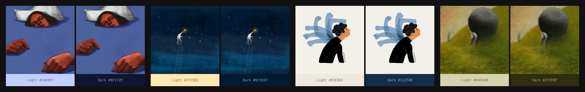

# image-to-theme-colors

Extract accessible light and dark theme background colors from any image. Designed for article pages where a hero image transitions into a colored background via a gradient.

Given an image, the algorithm analyzes its color composition and outputs two hex colors — one for a light theme, one for a dark theme — that harmonize with the image and meet WCAG AAA (7:1) contrast requirements against your text colors.



## Install

```bash
npm install image-to-theme-colors
```

Requires Node.js 18+ and [sharp](https://sharp.pixelplumbing.com/) (installed automatically).

## Quick start

```ts
import { imageToColors } from "image-to-theme-colors";

const { light, dark } = await imageToColors("./hero.jpg");
// light: "#C0D0FF"
// dark:  "#0F172F"
```

## API

### `imageToColors(input, options?)`

Analyzes an image and returns background colors for light and dark themes.

**Parameters:**

| Parameter | Type | Description |
|-----------|------|-------------|
| `input` | `string \| Buffer` | File path or image buffer |
| `options` | `ImageToColorsOptions` | Optional configuration |

**Options:**

| Option | Type | Default | Description |
|--------|------|---------|-------------|
| `lightThemeTextColor` | `string` | `"#2A2925"` | Text color on the light background (hex). The output guarantees 7:1 contrast against this. |
| `darkThemeTextColor` | `string` | `"#FFFFFF"` | Text color on the dark background (hex). The output guarantees 7:1 contrast against this. |

**Returns:** `Promise<ThemeColors>`

```ts
interface ThemeColors {
  light: string; // hex, e.g. "#C0D0FF"
  dark: string;  // hex, e.g. "#0F172F"
}
```

### Examples

With custom text colors:

```ts
const result = await imageToColors(buffer, {
  lightThemeTextColor: "#1A1A1A",
  darkThemeTextColor: "#F0F0F0",
});
```

From an HTTP upload (Express + multer):

```ts
app.post("/upload", upload.single("image"), async (req, res) => {
  const colors = await imageToColors(req.file.buffer);
  res.json(colors);
});
```

## How it works

The algorithm runs in four phases:

**1. Pixel extraction** — Resizes the image to 150px (preserving aspect ratio) and converts to HSL pixel data.

**2. Analysis** — Builds a hue histogram with extra weight on border/edge pixels (which are more likely to be the image background rather than the subject). Also detects accent colors, background tints, and bottom-edge colors for gradient transitions.

**3. Strategy selection** — Picks one of four approaches based on the image:

| Strategy | Trigger | Example |
|----------|---------|---------|
| **Achromatic** | Average saturation < 8% | B&W line art |
| **Dominant mid-tone** | Clear mid-tone color dominates | Green painting, blue illustration |
| **Light background** | Median lightness > 70% | Person on white/pastel background |
| **Dark background** | Mostly dark with bright accent | Night sky with a star |

**4. Color generation** — Produces light and dark colors using chroma-preserving lightness adjustment, iterative S/L co-solving, and WCAG AAA contrast enforcement.

### Design decisions

- **Background-first**: Border and bottom-edge pixels are weighted higher because the gradient transitions from the bottom of the image into the article text. The algorithm prioritizes the image's background color over foreground subjects.

- **Foreground detection**: When a foreground object extends to the bottom edge (e.g. hands), the algorithm detects this by checking whether the bottom color is concentrated at the bottom (background) or spread through the image (foreground).

- **Multi-hue images**: When the bottom edge has a distinctly different color from the dominant (e.g. green hill below blue sky), the algorithm uses the bottom color for the dark theme and the accent for the light theme.

## Performance

Processing a single image takes **50–100ms** on a modern CPU. The algorithm is fully CPU-bound (no GPU required).

## Development

```bash
git clone <repo-url>
cd image-to-theme-colors
npm install
```

**Run the validation suite** against the 10 reference examples:

```bash
npm run dev:validate
```

**Start the visual preview server** to test with your own images:

```bash
npm run dev:server
# Open http://localhost:3000
```

**Build the library:**

```bash
npm run build
```

## License

MIT
